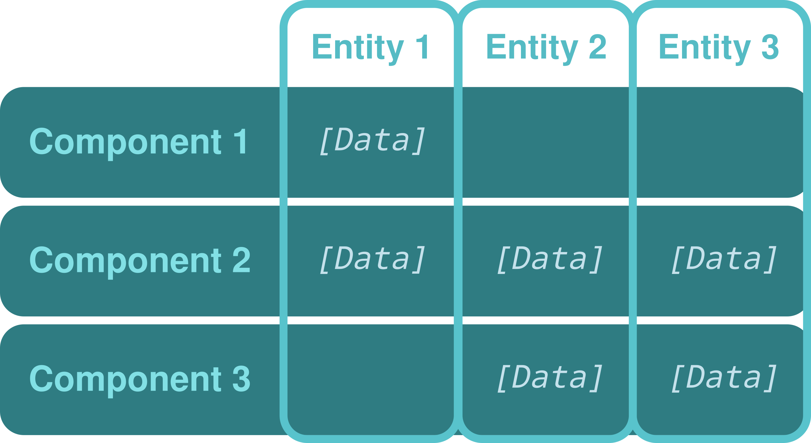
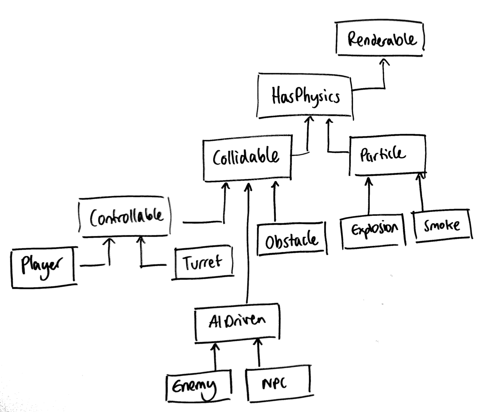
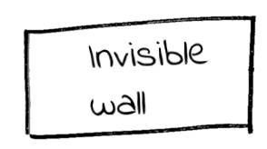
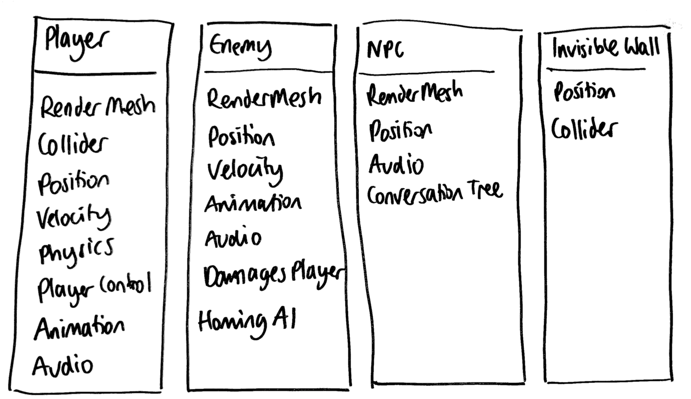
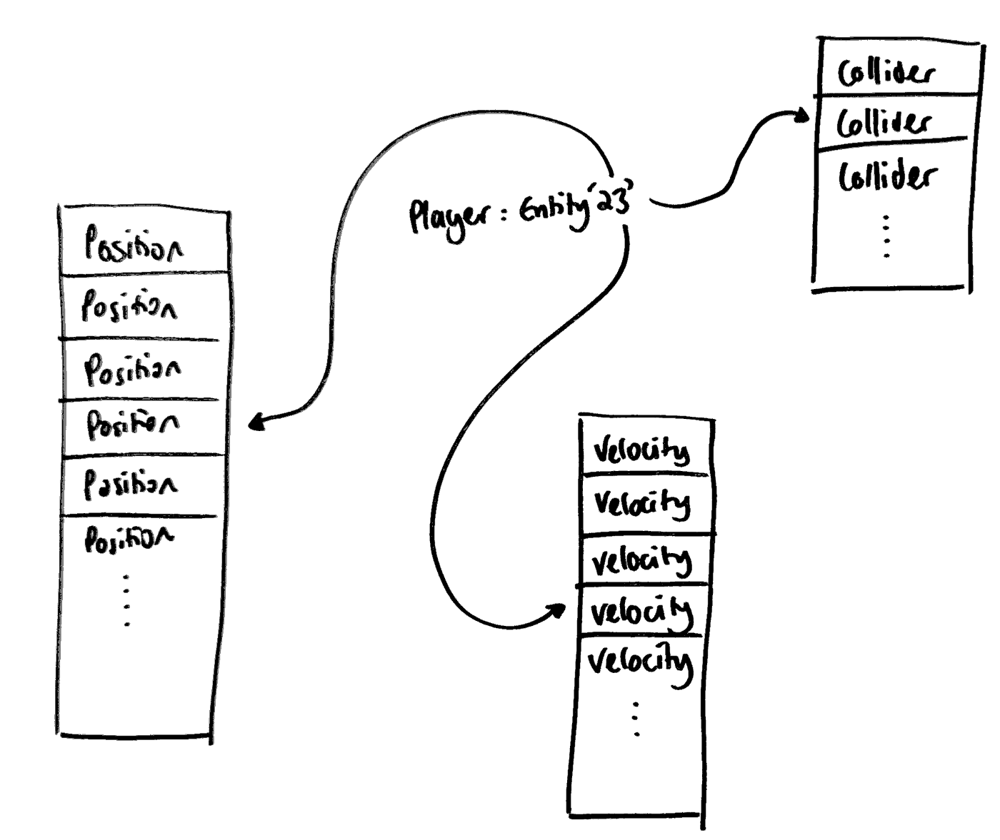
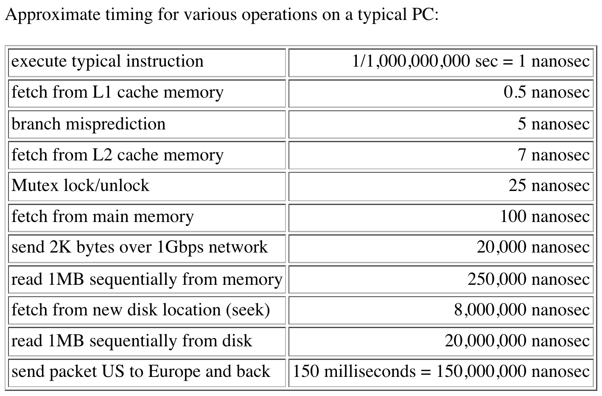
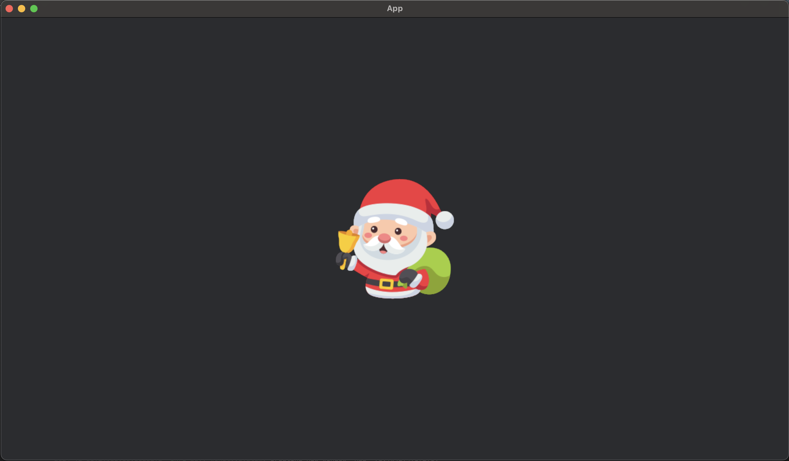

<!-- _class: lead -->


<!-- _color: orange -->
<!-- _footer: By Isak  -->

# Rust

## Game development with Bevy

---

<!-- _footer: ECS presentation content inspired/borrowed from Peder Voldnes Langdal  -->

# ECS

- Entity Component System
- Program architecture common in game development
- Suited for handling large amounts of data
- More cache-efficient
- Designed around composition over inheritance
- More decoupled than OOP-designed architectures, easier to maintain as projects grow in size
- Enables data-oriented design

---

# ECS

- Entity: A general-purpose object. Usually only a unique id. Used for _coarse_ game objects, e.g. characters, background objects, particles, etc.
- Component: Characterizes an entity to have an aspect, where the component holds necessary data to model that aspect. E.g. position, image, race (human, animal, etc.), etc.
- System: A process that acts on all entities which have the desired components. E.g. `draw_player` acts on entities with components `Player`, `Position` and `Image`/`Sprite`

---

# ECS



---

# Why not inheritance?

- In classical game designs, everything is represented using inheritance
- I



---

# How do you handle new requirements?




<!-- _footer: Images source https://medium.com/ingeniouslysimple/entities-components-and-systems-89c31464240d -->

---

# ECS vs OOP




---

# How is an entity stored?



```rust
// Instead of a structure holding all data
struct Player {
  position: Vec2,
  health: u32
}
// and a vector of all players
let players: Vec<Player> = ...;

// Just store it the other way around
struct Position(Vec2);
struct Health(u32);
struct Players {
  positions: Vec<Position>,
  healths: Vec<Health>
}
// First player is only an index into Players
let player1 = 0;
```

---

# AoS vs SoA

<style scoped>
section {
    font-size: 1.7rem;
}
</style>

- Code tends to use similar data at close timepoints
- Array of structures:
  - A structure holds all its data with multiple fields: `struct Player { pos: Pos, health: Health }`
  - You have an array of those structures: `Vec<Player>`
  - E.g. moving all positions means getting memory from a spread-out area of RAM, since positions are interleaved between health objects, leading to bad cache usage
- Structure of arrays:
  - A structure holds fields with arrays of data: `struct Players { positions: Vec<Pos>, healths: Vec<Health> }`
  - E.g. Moving positions now has good cache locality, since more positions will be in cache when using those values.

---

# Data-oriented design

- A way to write programs bringing the handling and storage of data in focus, where performance and memory usage is key
- CPU fast
- RAM slow
- Cache good, but limited in size
- Make sure to access data in patterns that use spatially- and temporally closely located data and your program is faster
- You only use what you need, so why drag everything else into the cache? ECS makes this explicit

---

# CPU architecture overview


---

# Latency numbers

<!-- _footer: Peter Norvig, 2009, http://norvig.com/21-days.html#answers -->



---

# ECS summarized

- A game is full of entities
- Entities have zero or more components of each kind
- Components don't talk together, they only have data
- Systems can read and mutate components, add or remove them, or spawn and despawn entities and their components

---

# Bevy

<style scoped>
section {
    font-size: 1.5rem;
}
</style>


- ECS-based game engine written in Rust
- Refreshing because everything is code and modular
- Everything is systems, even Bevy internals like rendering itself
- Supports 2D, 3D, animation, audio, hot-reloading
- Cross-platform (iOS/Android, Web, macOS, Linux, Windows)
- Free and open-source, actively developed
- Very performant. Automatic parallelization and efficient data structures
- Simple

---

# Bevy intro

Simplest Bevy program:

```rust
use bevy::prelude::*; // import all commonly-used Bevy stuff

fn main() {
    App::new().run();
}
```

What does it do? Nothing

---

# Bevy concepts

- `World` stores globally available data which only requires a single copy. E.g. image data, is game paused/loading/in-game
- `Schedule` determines _when_ a system is run. E.g. `Startup`, `Update`/`FixedUpdate` (every frame/fixed number of updates per second), and `Pre-`/`Post-` versions
- `Plugin`s are collections of features, everything in Bevy is built using plugins. Easy to enable/disable/configure specific features. E.g. `CameraPlugin` to render, `MovementPlugin` to move objects on screen, etc.

---

# Your first "useful" Bevy app

<style scoped>
section {
    font-size: 1.85rem;
}
</style>

```rust
use bevy::prelude::*;

fn main() {
    App::new().add_systems(Update, hello_system).run();
}

fn hello_system() {
    println!("Hello 👋");
}
```

- Pass our `hello_system`-function as an argument to `add_system`, run it using the `Update`-schedule.
- Prints `Hello 👋` once and quits
  - No window to open, no game-loop to run, just this one system, once.

---

# Adding `DefaultPlugins`

<style scoped>
section {
    font-size: 1.85rem;
}
</style>

```rust
use bevy::prelude::*; // assume this in every code example

fn main() {
    App::new()
        .add_plugins(DefaultPlugins) // 👈 New
        .add_systems(Update, hello_system)
        .run();
}

fn hello_system() {
    println!("Hello 👋");
}
```

- Spawns a window, prints a bunch of debug info
- Spams `Hello 👋` to the terminal as fast as it can, forever. - `Update` means once every frame, and since there is nothing to display on-screen, each frame

---

# System ordering

<style scoped>
section {
    font-size: 1.85rem;
}
</style>

```rust
fn main() {
    App::new()
        .add_plugins(DefaultPlugins)
        .add_systems(Startup, welcome)
        .add_systems(Update, (first, second))
        .run();
}
fn welcome() { println!("Welcome 👋"); }
fn first() { println!("1"); }
fn second() { println!("2"); }
```

- Run `welcome` on `Startup`, once
- Run `first`, then `second`, on `Update` (every frame)
- Prints `Welcome 👋` once, the `1` and `2` alternating, forever, as fast as it can

---

# Components

Creating a component is just writing any Rust type, and implement `Component` for it, using `#[derive(Component)]`

```rust
#[derive(Component)]
struct Player; // Component with _no_ data, marking a player

#[derive(Component)]
struct Position(Vec2); // Component marking a 2D position using a 2D-vector
```

---

# Commands and spawning entities

<style scoped>
section {
    font-size: 1.5rem;
}
</style>

`Commands` allows spawning and despawning entities, accessing their components, and more. Each command is pushed to a queue which is executed at a later "flush-point" after the system is finished.

```rust
fn main() {
    App::new()
        .add_plugins(DefaultPlugins)
        .add_systems(Startup, spawn_player)
        .run();
}

fn spawn_player(mut commands: Commands) {
    commands.spawn((Player, Position(Vec2::ZERO)));
    // Equivalent to
    commands
        .spawn_empty()
        .insert(Player)
        .insert(Position(Vec2::ZERO));
}
```

Opens a window, spawns an entity with two components (using a tuple): `Player`, and `Position` with a zero-vector.

---

# Querying components

- Systems can have no inputs, as we saw with `fn welcome() { ... }`, but are rarely that useful
- Systems can query for a combination of components, immutably or mutably
- Queries _have_ to follow Rust's borrow rules, but are runtime-enforced, so accepting two conflicting queries will crash
- Systems need to handle whether queries are empty or not themselves

---

# Querying player position

<style scoped>
section {
    font-size: 1.85rem;
}
</style>

```rust
// Add this in app setup:
// .add_systems(Update, (move_player, print_player_position))

//                                    👇 1            👇 2
fn move_player(mut player_query: Query<&mut Position, With<Player>>) {
    //                               👇 3
    for mut position in player_query.iter_mut() {
        position.0 += Vec2::ONE;
    }
}
//                                   👇 Only read position here
fn print_player_position(query: Query<&Position, With<Player>>) {
    for position in query.iter() {
        println!("Player is at position {}", position.0);
    }
}
```

---

<style scoped>
section {
    font-size: 1.9rem;
}
</style>

# Mutable, immutable and narrowed queries

1. `Query<&mut Position>` gives us an iterator over entities with position, and we have a mutable reference
2. `With<Player>` narrows the query to only give us entities also with the `Player`-component, but we don't need to access the `Player`-component's data
3. Note that to query over mutable data, we need to extract an iterator that gives us mutable access from the query: `query.iter_mut()`, similar for immutable access: `query.iter()`

If we want more components, just use a tuple: `Query<(&mut Position, &Health), Without<Player>>`. Queries all positions as mutable, gives immutable reference to health, as long as the entity does not have the `Player`-component (a marker)

---

# Result

- `spawn_player` spawns a player with position (0,0)
- `move_player` is called first, which moves position to `(1,1)`
- `print_player_position` is called secondly, which prints, and then repeat the previous step and this, forever
  Prints:

```
Player is at position [1, 1]
Player is at position [2, 2]
...
```

---

# Resources

- Resources are global values there only exists one of
- For example a list of all assets loaded and handles (images, audio, etc.), no need to store more than once
- Access resources from systems using `Res<MyResource>` for immutable access, or `ResMut<MyResource>` for mutable access
- Since resources are globally accessible, they must be registered with an initial value before systems are run

---

# Resources in action

<style scoped>
section {
    font-size: 1.6rem;
}
</style>

If we want to limit how often we say hello, we can do:

```rust
#[derive(Resource)]
struct GreetTimer(Timer);

fn main() {
    App::new()
        .insert_resource(GreetTimer(Timer::from_seconds(2.0, TimerMode::Repeating)))
        .add_plugins(DefaultPlugins)
        .add_systems(Update, say_hello)
        .run();
}

fn say_hello(time: Res<Time>, mut timer: ResMut<GreetTimer>) {
    if timer.0.tick(time.delta()).just_finished() {
        println!("Hello again!");
    }
}
```

Prints `Hello again!` every two seconds (maybe a bit more, but not sooner than 2 seconds!)

---

<style scoped>
  section {
    font-size: 1.55rem;
}
</style>

# Plugins

A collection of behavior moved together for readability and modularity:

```rust
fn main() {
    App::new().add_plugins(DefaultPlugins).add_plugins(greet_plugin::GreetPlugin).run();
}

mod greet_plugin {
    #[derive(Resource)]
    struct GreetTimer(Timer);
    pub struct GreetPlugin;

    impl Plugin for GreetPlugin {
        fn build(&self, app: &mut App) {
            app.insert_resource(GreetTimer(Timer::from_seconds(2.0, TimerMode::Repeating)))
                .add_systems(Update, say_hello);
        }
    }
    fn say_hello(time: Res<Time>, mut timer: ResMut<GreetTimer>) {
        if timer.0.tick(time.delta()).just_finished() {
            println!("Hello again!");
        }
    }
}
```

---

# Displaying images

```rust
fn main() {
    App::new()
        .add_plugins(DefaultPlugins)
        .add_systems(Startup, (spawn_camera, spawn_player))
        .run();
}

fn spawn_camera(mut commands: Commands) {
  commands.spawn(Camera2d);
}

fn spawn_player(mut commands: Commands, asset_server: Res<AssetServer>) {
    commands
        .spawn_empty()
        .insert(Sprite::from_image(asset_server.load("santa.png")));
}
```

---

# Result



---

# Transform

```rust
pub struct Transform {
    pub translation: Vec3,
    pub rotation: Quat,
    pub scale: Vec3,
}
```

- [Transforms](https://docs.rs/bevy/latest/bevy/prelude/struct.Transform.html) are the backbone of positioning.
- Everything with a `Sprite` and `Transform` is drawn on screen at some `transform.translation` (position), with some `transform.rotation` and at some `transform.scale`
- Even in 2D, `Vec3` is used for positioning, where the z-component is the draw order of images, with higher z-values being drawn last
