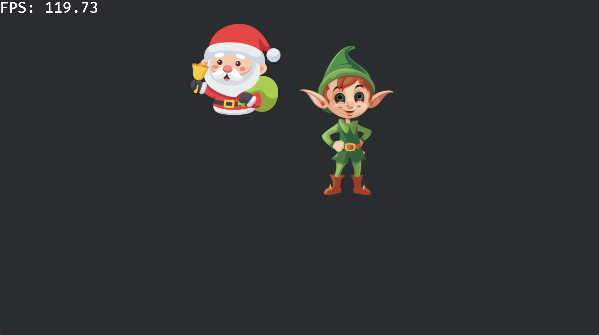
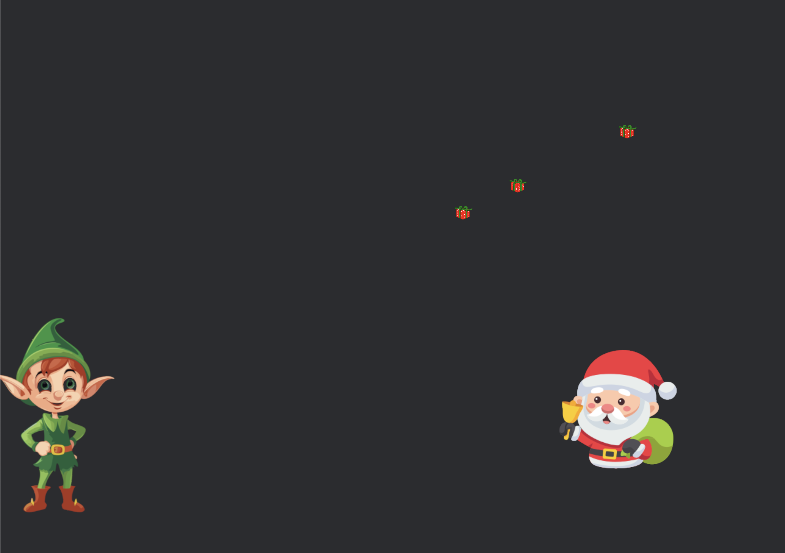
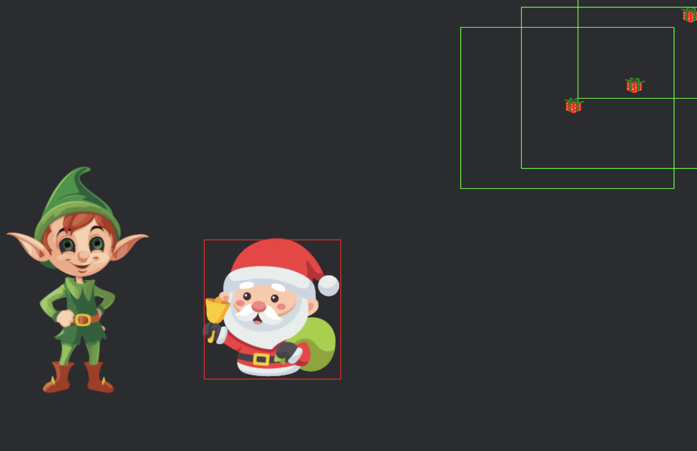
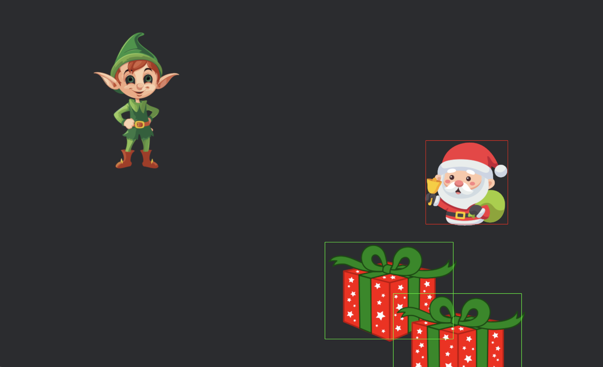
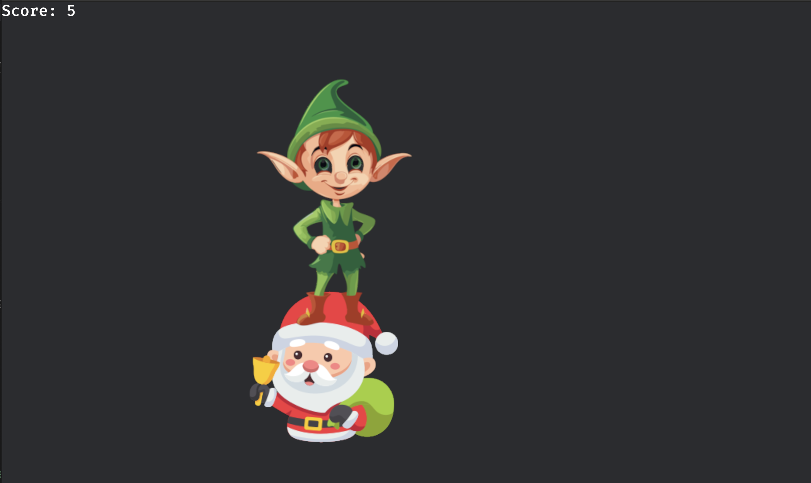
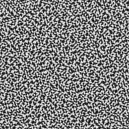
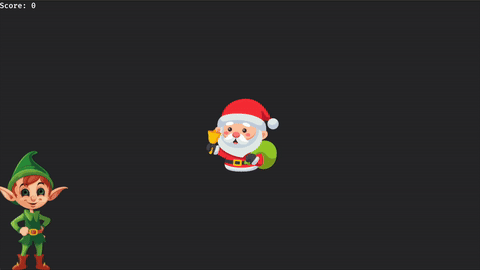
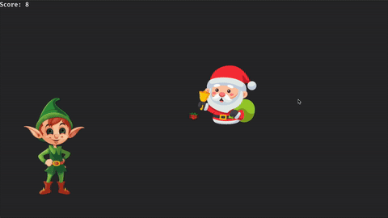

# Rust game development workshop

## Getting started

Make sure you've walked through the presentation in [Intro.md](./Intro.md) before starting, as it introduces ECS and Bevy.

### Installing Rust

Install Rustup (version manager for Rust tooling) from: https://rustup.rs/

This workshop is tested and developed using Rust 1.83.

## Bevy 0.15

This workshop uses [Bevy 0.15](https://bevyengine.org/news/bevy-0-15/), but it is quite recently released at the time of writing. Bevy is actively developed and has frequent breaking changes.

### Pre-code

This project is a scaffolding for a Bevy project. It is set up to show how to get an image on screen and use a state. It has a debug inspector console that can be enabled/disabled using the key `d`. Try to use the inspector to learn a bit more about what the default setup does, but keep in mind that the debug inspector plugin also adds some stuff which appears in the inspector

Head to [src/main.rs](./src/main.rs) to get started.

## Workshop structure

This guide is intended to be read on [GitHub](https://github.com/IsakSundeSingh/rust-bevy-workshop?tab=readme-ov-file#workshop-structure). That way, you get a rendered page, and all the formatting is as I intended when I wrote it.

This workshop is intended to be a guide for getting started with some game development with Rust and Bevy. I advise you to try to get through the assignments, as they will show you enough of the "rough parts" to get a working game going.

However, you are free and _encouraged_ to add new features on top of this workshop if you want to.

Each assignment will get one feature working. Features might be improved upon in a later assignment, so don't worry too much if it isn't as polished as you want. Or you could try to make it better. Your choice.

**Cooperation** with others is encouraged, please be active in asking for help or contributing.

> [!TIP]
> Assignments might have _tip_ blocks that will help you overcome an assignment.

**Bonus exercises** Make up your own! OR just look at the bottom of this workshop to check out some suggested bonus exercises.

<details>
<summary>Solution ✅ (Open me)</summary>

If you're stuck, check out these blocks for a _suggested_ solution. You might finish the assignment some other way, but future assignments will assume you solved an assignment in the way the suggested solution does.

**Remember** It's sort of expected that you at least take a look at these. Or just do things as explained in the suggested solution.Otherwise you might get a surprisingly difficult coming assignment if it does something differently from how you did it.

</details>

> [!TIP]
> Solutions can also be seen commit-by-commit on the `solution`-branch.

## What game are we making?

> It is the day before Christmas. Santa Claus has a big day ahead, but he has been at a Christmas party with his friends, and is quite intoxicated. 🍻
>
> You are a poor elf working in the gift factory. Your job is to ensure that Santa receives all the presents he needs to make everyone happy for Christmas.
>
> Santa walks erratically around the factory floor, and you have to throw presents that land in his sack so children will get their presents for Christmas day.

### Gameplay

The game developed in this workshop is a top-down 2D shooter-type game. Elfs try to throw presents towards Santa Claus and his sack of presents. You get points for each present you hit.

---

## Game development with Bevy and Rust

> [!TIP]
> Run `cargo doc --open` to get all documentation for Bevy and your dependencies, locally

> [!TIP]
> Check out https://bevyengine.org/learn/ for resources on Bevy and examples of Bevy programs to see how to solve certain problems

### Assignment 1: Movement 🎅

Your pre-code includes code for spawning an image of a santa claus, but the santa does not move!

**Assignment:** Make Santa move to the right of the screen, with a speed of 1 px per frame

<details>
<summary>Solution ✅</summary>

To make santa move, you need to write a system that queries for Santa's `Transform`, mutably, so `&mut Transform` and then move Santa accordingly.

Add a marker component to the Santa so we can query for just him:

```rust
#[derive(Component)]
struct Santa;
```

Add that to Santa's components:

```diff
fn spawn_santa(mut commands: Commands, asset_server: Res<AssetServer>) {
    commands
        .spawn_empty()
+        .insert(Santa)
        .insert(Transform::from_xyz(0.0, 0.0, 0.0))
        .insert(Sprite::from_image(asset_server.load("santa.png")));
}
```

Add the system:

```rust
fn move_santa(mut query: Query<&mut Transform, With<Santa>>) {
    let mut santa_transform = query.single_mut();
    // Translation is internally a 3D-vector so we just set the z-position to 0
    // but we can use the z-position to define in which order sprites should be
    // drawed, with a higher z-position meaning later draw order.
    santa_transform.translation += Vec3::new(1.0, 0.0, 0.0);
}
```

Then we need to register the system to run every frame, which is the `FixedUpdate`-schedule, so:

```diff
        .add_systems(Startup, (spawn_camera, spawn_santa))
-        .add_systems(Update, toggle_debug_mode)
+        .add_systems(FixedUpdate, (toggle_debug_mode, move_santa))
        .run();
```

And just like that, Santa should move!

</details>

---

### Assignment 2: Move Santa in a circle

Great! Santa's moving around, but walking in a straight direction off-screen and is lost forever. Let's try to move him in a circle!

**Assignment:** Instead of moving santa linearly, move Santa in a circle of diameter 250 px, repeatedly.

> [!TIP]
> Check out [`FunctionCurve<T>`](https://docs.rs/bevy/latest/bevy/math/prelude/struct.FunctionCurve.html) to see if it can help you out and [sample](https://docs.rs/bevy/latest/bevy/math/trait.Curve.html#method.sample) the curve points?

> [!TIP]
> Remember that you can create a circle by using `sin(t)` and `cos(t)` as `x`- and `y`-positions, respectively

> [!TIP]
> If you need an ever-increasing number, what number is ever-increasing for every second that ticks?

<details>
<summary>Solution ✅</summary>

Okay, so this might be a bit more difficult than the first assignment...

To move Santa in a circle, let's start by creating a curve that represents a circle. A unit circle can be written in its parametric form as:

```math
x = a + r*sin(t)

y = b + r*cos(t)
```

Where `a` and `b` are the points of origin. Let's just use origin 0 and radius 1.

In our `move_santa`-system, create a `FunctionCurve` that represents a circle, returning a `Vec3` for each point:

```rust
let circle = FunctionCurve::new(Interval::EVERYWHERE, |t| Vec3::new(t.sin(), t.cos(), 0.0));
```

`Curve`s in Bevy can be sampled at any point `t`, so if we set `Interval::EVERYWHERE`, we can pass in any (valid) value of `f32` and expect a `Vec3` as output. This is because `sin` and `cos` are defined over all of the valid numbers in `f32`.

To make Santa move in this circle, accept another parameter to `move_santa` so the signature becomes:

```rust
fn move_santa(mut query: Query<&mut Transform, With<Santa>>, time: Res<Time>)
```

Now we can extract the time elapsed since startup and use that as input to our sampling function. Since we are sampling values of a unit circle, just multiply the resulting vector with 250 to get Santa moving in a larger circle!

```rust
fn move_santa(mut query: Query<&mut Transform, With<Santa>>, time: Res<Time>) {
    let mut santa_transform = query.single_mut();

    let circle = FunctionCurve::new(Interval::EVERYWHERE, |t| Vec3::new(t.sin(), t.cos(), 0.0));

    santa_transform.translation = circle.sample(time.elapsed_secs_wrapped()).unwrap() * 250.0;
}
```

</details>

---

### Assignment 3: Adding an elf!

Santa's looking kind of lonesome, let's add an Elf to our game.

**Assignment:** Add a new entity with a new component for drawing an elf. For the image, use the one you drew in the group assignment. Additionally, replace the Santa with your wanted Santa.

> [!TIP]
> Take a look at how Santa's code is set up

<details>
<summary>Solution ✅</summary>

This should be simpler again!

Essentially copy the code of the Santa and just place the elf somewhere else on screen:

```rust
#[derive(Component)]
struct Elf;

fn spawn_elf(mut commands: Commands, asset_server: Res<AssetServer>) {
    commands
        .spawn_empty()
        .insert(Elf)
        .insert(Transform::from_xyz(100.0, 100.0, 0.0))
        .insert(Sprite::from_image(asset_server.load("elf.png")));
}
```

And register the system to run on `Startup` in `main`:

```diff
-        .add_systems(Startup, (spawn_camera, spawn_santa))
+        .add_systems(Startup, (spawn_camera, spawn_santa, spawn_elf))
```

## </details>

### Assignment 4: Move that elf!

How boring is a non-moving elf? Make the elf move by using the keyboard input!

**Assignment:** Make the elf move by using keyboard inputs (left, right, up and down arrows). A max speed of 10 pixels per frame sounds reasonable.

> [!TIP]
> Check out the [ButtonInput](https://docs.rs/bevy/latest/bevy/input/struct.ButtonInput.html) _resource_

<details>
<summary>Solution ✅</summary>

Add a new system, `move_elf` which reads from keyboard keys and moves the elf accordingly:

```rust
fn move_elf(
    mut query: Query<&mut Transform, With<Elf>>,
    keyboard_input: Res<ButtonInput<KeyCode>>,
) {
    let mut elf_transform = query.single_mut();

    let move_left = keyboard_input.any_pressed([KeyCode::ArrowLeft, KeyCode::KeyA]);
    let move_right = keyboard_input.any_pressed([KeyCode::ArrowRight, KeyCode::KeyD]);
    let move_up = keyboard_input.any_pressed([KeyCode::ArrowUp, KeyCode::KeyW]);
    let move_down = keyboard_input.any_pressed([KeyCode::ArrowDown, KeyCode::KeyS]);

    let mut delta = Vec2::ZERO;
    if move_left {
        delta.x -= 1.0;
    }
    if move_right {
        delta.x += 1.0;
    }
    if move_down {
        delta.y -= 1.0;
    }
    if move_up {
        delta.y += 1.0;
    }
    // If no input keys are performed, delta will be a zero-vector,
    // which because of floating-point inaccuracy will lead to a bad result
    // when normalizing, so use `normalize_or_zero` to default to a
    // zero-vector here for no movement.
    let delta = delta.normalize_or_zero();

    // Copy the z-component so it is drawn the same z-position as before (which was 0)
    let z = elf_transform.translation.z;
    elf_transform.translation += Vec3::new(delta.x, delta.y, z) * 10.0;
}
```

Register the system in the `FixedUpdate`-schedule:

```diff
-        .add_systems(FixedUpdate, (toggle_debug_mode, move_santa))
+        .add_systems(FixedUpdate, (toggle_debug_mode, move_santa, move_elf))
```

_Note_ that this simply moves the elf from a to b, instantly, with no smoothing. A better solution would be to _linearly interpolate_ ([lerp](https://docs.rs/bevy/latest/bevy/math/f32/struct.Vec3.html#method.lerp)) from one position to another, using an [easing](https://docs.rs/bevy/latest/bevy/math/prelude/enum.EaseFunction.html) motion.

Since we are adding wasd-movement, we have a conflicting keyboard-combination with the debug-console, so change that code to use Ctrl-D:

```diff
fn toggle_debug_mode(
    keyboard_input: Res<ButtonInput<KeyCode>>,
    debug_mode: Res<State<DebugMode>>,
    mut next_state: ResMut<NextState<DebugMode>>,
) {
-    if keyboard_input.just_pressed(KeyCode::KeyD)
+    if keyboard_input.just_pressed(KeyCode::KeyD) && keyboard_input.pressed(KeyCode::ControlLeft) {
    {
        next_state.set(debug_mode.get().toggle());
    }
}
```

</details>

---

### Assignment 5: Throw a present

Our elf looks sort-of strange just moving around for no reason. Let's let him throw some packages!

**Assignment:** Use the presents you drew to make a present spawn when the spacebar is pressed, and move the present towards the x-direction, just like the santa moved in assignment 1, 1 px per frame. Make sure the presents spawn from the elf's position.

> [!TIP]
> If you need the elf's position in addition to some other info, just _query_ for it.

<details>
<summary>Solution ✅</summary>

Add a system that spawns an entity with a `Present`-component and a transform located at the elf position:

```rust
#[derive(Component)]
struct Present;

fn throw_present(
    query: Query<&Transform, With<Elf>>,
    asset_server: Res<AssetServer>,
    keyboard_input: Res<ButtonInput<KeyCode>>,
    mut commands: Commands,
) {
    let elf_transform = query.single();

    if keyboard_input.just_pressed(KeyCode::Space) {
        commands
            .spawn_empty()
            .insert(Present)
            .insert(Transform {
                scale: elf_transform.scale / 10.0,
                ..*elf_transform
            })
            .insert(Sprite::from_image(asset_server.load("present.png")));
    }
}
```

Then, go on to make a system for moving the presents:

```rust
fn move_present(mut query: Query<&mut Transform, With<Present>>) {
    for mut present_transform in query.iter_mut() {
        present_transform.translation += Vec3::new(10.0, 0.0, 0.0);
    }
}
```

And register the systems:

```diff
-        .add_systems(FixedUpdate, (toggle_debug_mode, move_santa, move_elf))
+        .add_systems(FixedUpdate, (toggle_debug_mode, move_santa, move_elf, throw_present, move_present))
```

Now run it and press space and you should see something like this abomination:


</details>

---

### Assignment 6: Throw a present towards the mouse

All right, the elf can now throw a present to the right, but what use is that! It needs to throw presents towards the Santa! If only it could _point_ towards the santa to try to hit him with the present...

**Assignment:** Change the code to grab the mouse position when throwing a present, and throw the present towards the mouse. Also, add code so that you can either press space or click the mouse to throw!

> [!TIP]
> Cursors are tricky, because they're not necessarily always on your window! Perhaps you should create a resource of the last position the cursor was on? This part is tricky enough, so I advise you to just copy-paste the system for getting the correct mouse position from below.

<details>
<summary>Mouse position system code</summary>

```rust
// Example usage
fn main() {
    App::new()
        .init_resource::<CursorPosition>()
        .add_systems(Update, update_cursor_position);
}


/// The last known cursor position
///
/// Is not updated when the cursor is moved outside the main window
#[derive(Resource, Default)]
pub struct CursorPosition(Vec2);

fn update_cursor_position(
    mut cursor_position: ResMut<CursorPosition>,
    window_query: Query<&Window>,
    camera_query: Query<(&Camera, &GlobalTransform), With<MainCamera>>,
) {
    if window_query.is_empty() || camera_query.is_empty() {
        return;
    }

    let (camera, camera_transform) = camera_query.single();

    // We need the window to calculate the position of the cursor _on_ the main window
    let window = window_query.single();

    // Use `camera.viewport_to_world` to get a ray between viewport
    // coordinates to world coordinates to extract the
    // cursor position along that ray
    if let Some(position) = window
        .cursor_position()
        .and_then(|cursor| camera.viewport_to_world(camera_transform, cursor).ok())
        .map(|ray| ray.origin.truncate())
    {
        // Use `RUST_LOG=trace cargo run` to see this and so much more
        trace!("Cursor moved: {}", position);
        cursor_position.0 = position;
    }
}
```

And add a `MainCamera`-component to the camera so it is uniquely queryable. Change `spawn_camera` to the following:

```rust
#[derive(Component)]
struct MainCamera;

fn spawn_camera(mut commands: Commands) {
    commands.spawn((Camera2d, MainCamera));
}
```

</details>

<details>
<summary>Solution ✅</summary>

Now that you have the hardest part done, which is getting the cursor position, it's time to implement the logic for moving the present towards where the cursor was when it was thrown.

Since we are working with vectors, we just need to get a vector from the elf's position to the cursor position, which gives us a directional vector on where to throw.

Add a component called `Speed` which just wraps a `Vec2` representing what speed an entity has in a certain direction:

```rust
#[derive(Component)]
struct Speed(Vec2);
```

Change your `throw_present`-system code to:

```diff
fn throw_present(
    query: Query<&Transform, With<Elf>>,
    asset_server: Res<AssetServer>,
    keyboard_input: Res<ButtonInput<KeyCode>>,
+    cursor_position: Res<CursorPosition>,
    mut commands: Commands,
) {
    let elf_transform = query.single();
+
+    let throw_direction = (cursor_position.0 - elf_transform.translation.truncate()).normalize();

    if keyboard_input.just_pressed(KeyCode::Space) {
        commands
            .spawn_empty()
            .insert(Present)
            .insert(Transform {
                scale: elf_transform.scale / 10.0,
                ..*elf_transform
            })
+            .insert(Speed(throw_direction * 10.0))
            .insert(Sprite::from_image(asset_server.load("present.png")));
    }
}
```

And now change the code for `move_present` to use the new `Speed`-component:

```diff
-fn move_present(mut query: Query<&mut Transform, With<Present>>) {
+fn move_present(mut query: Query<(&mut Transform, &Speed), With<Present>>) {
    for (mut present_transform, speed) in query.iter_mut() {
-        present_transform.translation += Vec3::new(10.0, 0.0, 0.0);
+        present_transform.translation += Vec3::new(speed.0.x, speed.0.y, 0.0);
    }
}
```

</details>

<details>
<summary>Solution for mouse click to throw✅</summary>

If you want mouse clicks to also throw presents, just listen to mouse click events:

```diff
fn throw_present(
    query: Query<&Transform, With<Elf>>,
    asset_server: Res<AssetServer>,
    keyboard_input: Res<ButtonInput<KeyCode>>,
+    mouse_input: Res<ButtonInput<MouseButton>>,
    cursor_position: Res<CursorPosition>,
    mut commands: Commands,
) {
    let elf_transform = query.single();

    let throw_direction = (cursor_position.0 - elf_transform.translation.truncate()).normalize();

-    if keyboard_input.just_pressed(KeyCode::Space) {
+    if keyboard_input.just_pressed(KeyCode::Space) || mouse_input.just_pressed(MouseButton::Left) {
        commands
            .spawn_empty()
            .insert(Present)
            .insert(Transform {
                scale: elf_transform.scale / 10.0,
                ..*elf_transform
            })
            .insert(Speed(throw_direction * 10.0))
            .insert(Sprite::from_image(asset_server.load("present.png")));
    }
}
```

</details>

---

### Assignment 7: Performance issues?

At least on my machine, this kind of lags? Every mouse-click should in theory spawn a present but if I spam-click the mouse button, why doesn't presents just brrrt out? Is it slow? Is it fast enough? Your eye is pretty bad for determining performance issues, maybe we should at least know how fast the screen refreshes to see if that is a problem!

**Assignment:** Display the _frames per second_ (FPS) the game renders, somewhere on-screen. Only display this in debug-mode.

> [!TIP]
> Take a look in the Bevy docs to see if they have something to help adding a [FPS overlay](https://docs.rs/bevy/latest/bevy/dev_tools/fps_overlay/struct.FpsOverlayPlugin.html). If you're having trouble to use this, maybe it's a [feature](https://docs.rs/bevy/latest/bevy/index.html#cargo-features) and not a bug?

<details>
<summary>Solution ✅</summary>

Let's be a bit lazy. Not everything has to be done by hand.

Let's just use Bevy's built-in developer tools!

Enable the `bevy_dev_tools` as described in the docs, just add this to the `Cargo.toml`:

```diff
[dependencies]
-bevy = { version = "0.15.0", features = ["dynamic_linking"] }
+bevy = { version = "0.15.0", features = ["dynamic_linking", "bevy_dev_tools"] }
bevy-inspector-egui = "0.28.0"
```

Now the `bevy::dev_tools`-module should be accessible.

In your `main`-function, add this plugin:

```diff
    App::new()
        .add_plugins(DefaultPlugins)
        .init_state::<DebugMode>()
+        .add_plugins(bevy::dev_tools::fps_overlay::FpsOverlayPlugin::default())
        .init_resource::<CursorPosition>()
```

Running the game should now look like this:



Awesome! However, it shows up even if we are running _not_ in debug mode. If we take a look at the plugin docs, we can pass in a config instead of using `default()` to generate a config. To start, let's disable the overlay when initializing the plugin:

```diff
    let mut fps_overlay_plugin = bevy::dev_tools::fps_overlay::FpsOverlayPlugin::default();
    fps_overlay_plugin.config.enabled = false;
    App::new()
        .add_plugins(DefaultPlugins)
        .init_state::<DebugMode>()
-        .add_plugins(bevy::dev_tools::fps_overlay::FpsOverlayPlugin::default())
+        .add_plugins(fps_overlay_plugin)
```

Alright, now it doesn't show up by default. Onto actually showing it. We have our `toggle_debug_mode`-system which we can extend. If we look at the documentation again, the config is a resource, so we can query for that!

```diff
fn toggle_debug_mode(
    keyboard_input: Res<ButtonInput<KeyCode>>,
    debug_mode: Res<State<DebugMode>>,
+    mut fps_overlay_config: ResMut<FpsOverlayConfig>,
    mut next_state: ResMut<NextState<DebugMode>>,
) {
    if keyboard_input.just_pressed(KeyCode::KeyD) && keyboard_input.pressed(KeyCode::ControlLeft) {
+        let debugging = debug_mode.get().toggle();
+        fps_overlay_config.enabled = matches!(debugging, DebugMode::On);
-        next_state.set(debug_mode.get().toggle());
+        next_state.set(debugging);
    }
}
```

And tada! Enabling the debug-mode now shows our fps overlay, but only then!

Huh, turns out our game renders at around 120 fps! Sick.

</details>

---

### Assignment 8: Catching our presents

Turns out our game runs at a pretty fast FPS at least. Is it lagging? I don't know, but we can come back to that.

For now, what is this? This is barely a game, we have a Santa that's more confused than drunk, walking in circles, and an elf just yeeting presents willy nilly. Time to check if our Santa can catch some!

**Assignment:** Implement collision-handling between the presents and Santa, so that if a present collides with Santa, it [despawns](https://docs.rs/bevy/latest/bevy/ecs/prelude/struct.EntityCommands.html#method.despawn) and a score-counter goes up. It is fine to just print the score to the console when it increases for now.

> [!NOTE]
> Collision-handling may be difficult depending on how advanced you want to implement it. For our game, or at least for this assignment, it is fine to do it a bit brute-forcey and not as efficient as it could be.

> [!TIP]
> A common way to check for collisions is to check for the intersection between two [_axis-aligned bounding boxes_](https://docs.rs/bevy/latest/bevy/math/bounding/struct.Aabb2d.html) (AABB).

> [!TIP]
> If you want the size of an image, you can get a handle to it using the `AssetServer` and [get](https://docs.rs/bevy/latest/bevy/asset/struct.Assets.html#method.get) the asset to retrieve it's information. [`AssetServer::load`](https://docs.rs/bevy/latest/bevy/asset/struct.AssetServer.html#method.load) doesn't load already loaded assets again, so it's not that bad of a performance hit.

<details>
<summary>Solution ✅ (Getting image sizes)</summary>

To retrieve an image's size, we can do the following:

```rust
fn get_size(
    assets: Res<Assets<Image>>,
    asset_server: Res<AssetServer>,
) {
    let handle = asset_server.load("santa.png");
    let image = assets.get(&handle).unwrap();
    let size = image.size();
}
```

</details>

<details>
<summary>Solution ✅ (Collision-handling)</summary>

Add a new system called `handle_santa_present_collisions`. We know we at least need to query for the Santa, the presents, we need to load assets and retrieve information on it using `Assets<Image>`, and we need to despawn the presents, which is done through `Commands`:

```rust
fn handle_santa_present_collisions(
    santa: Query<&Transform, With<Santa>>,
    presents: Query<&Transform, With<Present>>,
    assets: Res<Assets<Image>>,
    asset_server: Res<AssetServer>,
    mut commands: Commands,
)
```

In this system, first off, let's just return early if there aren't any presents to check collisions for:

```rust
if santa.is_empty() || presents.is_empty() {
    return;
}
```

Next up, let's create our bounding boxes, which needs the center position of the entity, and its "half size" which is just... half the size of the entity. What did you expect?

To do this, let's first retrieve our images and calculate their size, using the code we saw in the solution above:

```rust
let santa_transform = santa.single();
let santa_bounding_box = {
    let handle = asset_server.load("santa.png");
    let image = assets.get(&handle).unwrap();

    let size = image.size();
    let half_size = size.as_vec2() / 2.0;
    Aabb2d::new(santa_transform.translation.truncate(), half_size)
};

// Since we need to figure out _every_ present's position for their bounding box, let's just calculate its "half size" for now
let present_half_size = {
    let handle = asset_server.load("present.png");
    let image = assets.get(&handle).unwrap();
    let size = image.size();
    size.as_vec2() / 2.0
};
```

Now, we just need to iterate through every present and see if its bounding box collides with the Santa's bounding box:

```rust
for present_transform in presents.iter() {
    let present_bounding_box =
        Aabb2d::new(present_transform.translation.truncate(), present_half_size);

    if present_bounding_box.intersects(&santa_bounding_box) {
        // Santa caught a present!
        println!("Santa caught a present!");
    }
}
```

Great! Register the system to run on `FixedUpdate` and check if it works:

```diff
    .add_systems(
        FixedUpdate,
        (
            toggle_debug_mode,
            move_santa,
            move_elf,
            throw_present,
            move_present,
+            handle_santa_present_collisions,
        ),
    )
```

</details>

<details>
<summary>Solution ✅ (Score counting and removing presents)</summary>

This should be a bit easier to keep up with.

First off, we want to keep a _global_ score of how many presents the Santa's caught. We know that globally unique values are stored as _resources_! Add a new resource called `Score` with a number inside, and register it:

```rust
#[derive(Resource, Debug, Default)]
struct Score(u32);
```

And in `main`:

```diff
    .init_resource::<CursorPosition>()
+    .init_resource::<Score>()
```

Note that resources just need to be registered _before_ a system tries to use it, but it doesn't need to stay all the way at the top. That's just a habit, to register resources before systems. Although our code is quite messy at the moment.

Change the code in the `handle_santa_present_collisions` to accept `Commands`, we need this to despawn presents, and a mutable resource accessor to `Score`. Additionally, we need to know the entity id of presents to despawn them, so query for that as well:

```diff
fn handle_santa_present_collisions(
    santa: Query<&Transform, With<Santa>>,
-    presents: Query<&Transform, With<Present>>,
+    presents: Query<(&Transform, Entity), With<Present>>,
    assets: Res<Assets<Image>>,
    asset_server: Res<AssetServer>,
+    mut score: ResMut<Score>,
+    mut commands: Commands,
) {
```

And in our loop where we know we have a collision:

```diff
-for present_transform in presents.iter() {
+for (present_transform, entity) in presents.iter() {
    let present_bounding_box =
        Aabb2d::new(present_transform.translation.truncate(), present_half_size);

    if present_bounding_box.intersects(&santa_bounding_box) {
        // Santa caught a present!
-        println!("Santa caught a present!");
+
+       // Try to get the present and despawn it
+        if let Some(mut entity) = commands.get_entity(entity) {
+            entity.despawn();
+        }
+        score.0 += 1;
+        println!("Santa caught a present! Score: {}", score.0);
    }
}
```

And there you go!

</details>

> [!TIP]
> If you are having trouble with presents seemingly hitting "nothing" and despawning, check that the images you use are properly cropped so that the edges of the image don't count as part of the bounding box. You could also tune the "half sizes" of the bounding boxes to be a bit smaller, test it out by 10/20 %.

---

### Assignment 9: Debugging collisions

Is it just me or does the collision handling seem whack?
Sometimes presents are caught waay outside what I would consider Santa's bounding box. We have a Christmas murder mystery on our hands! Or perhaps not _murder_ mystery, but a mystery nonetheless!



**Assignment:** Use [Gizmos](https://bevyengine.org/examples/gizmos/2d-gizmos/) to draw the bounding boxes for presents and the santa to better understand why collisions seem to be bugged. And fix it of course!

> ![TIP]
> Gizmos are an _immediate-mode_ render feature, meaning the are drawn on screen immediately when constructed, at a given position, for that given frame. On the next frame, if the draw call is not performed, nothing will be drawn.
>
> This is totally fine for debugging purposes, but for most rendering, we want to use a smarter render pipeline, which is why we don't do this for most gameplay-drawing.

<details>
<summary>Solution ✅ (Adding gizmos)</summary>

Alright, adding Gizmos is not as difficult as the example I linked to makes it seem like. To our collision-handler, simply add this as a parameter:

```diff
fn handle_santa_present_collisions(
    santa: Query<&Transform, With<Santa>>,
    presents: Query<(&Transform, Entity), With<Present>>,
    assets: Res<Assets<Image>>,
    asset_server: Res<AssetServer>,
    mut score: ResMut<Score>,
    mut commands: Commands,
+    mut gizmos: Gizmos,
) {
```

And before our loop, we can draw Santa's bounding box as a rectangle. We don't do it inside the loop as that would be unnecessary.

We want to draw rectangles along the bounding boxes, so we can use `Gizmos::rect2d`. However, since the world isn't always as simple as we want it to, it accepts first an `Isometry`, then a size, and then a color. An isometry is a rotation followed by a translation, which is useful in a bunch of cases, but for us we just want the translation (positioning) and no rotation, so we can use:

```rust
gizmos.rect_2d(
    Isometry2d::from_translation(santa_bounding_box.center()),
    santa_bounding_box.half_size() * 2.0,
    Color::srgb(1.0, 0.0, 0.0),
);
```

For the color I just went with red. Do the same for each present inside the loop:

```diff
for (present_transform, entity) in presents.iter() {
    let present_bounding_box =
        Aabb2d::new(present_transform.translation.truncate(), present_half_size);

+    gizmos.rect_2d(
+        Isometry2d::from_translation(present_bounding_box.center()),
+        present_bounding_box.half_size() * 2.0,
+        Color::srgb(0.0, 1.0, 0.0),
+    );
```

</details>

Our gizmos show us our problem!

<details>
<summary>The bug presented using gizmos</summary>



Drawing gizmos for bounding boxes shows us that our presents have a huuge bounding box! The santa's bounding box is correct, however. But why are the present's bounding boxes incorrect? Could it be our image size? Could it be something else? Let's try to tip the _scales_ in our favor.

</details>

<details>
<summary>Solution ✅ (Fixing the bug)</summary>

Since our image is properly cropped, and we do the same image-size extracting logic for our present images as our Santa image, why is the present's bounding box incorrect?

Well, as we've seen before, `Transform`s contain both a position, rotation and a _scale_! Aha! I remember, if you've followed the suggested solution code you will have this bug (in `throw_present`):

```rust
    if keyboard_input.just_pressed(KeyCode::Space) || mouse_input.just_pressed(MouseButton::Left) {
        commands
            .spawn_empty()
            .insert(Present)
            .insert(Transform {
                scale: elf_transform.scale / 10.0,
                ..*elf_transform
            })
            .insert(Speed(throw_direction * 10.0))
            .insert(Sprite::from_image(asset_server.load("present.png")));
    }
```

Why the heck do we use the elf's scale from its transform for the present thrown? Well this was obviously because we wanted its translation, but not the other parts. Let's just try to use `Vec3::ONE` (scale 1:1):

```diff
    if keyboard_input.just_pressed(KeyCode::Space) || mouse_input.just_pressed(MouseButton::Left) {
        commands
            .spawn_empty()
            .insert(Present)
            .insert(Transform {
-                scale: elf_transform.scale / 10.0,
+                scale: Vec3::ONE,
                ..*elf_transform
            })
            .insert(Speed(throw_direction * 10.0))
            .insert(Sprite::from_image(asset_server.load("present.png")));
    }
```

Let's see how that looks:



Alright! The gizmo draws the bounding box correctly, but now our present is really big. Let's add a global constant for the present scale to make it more sizable:

```rust
const PRESENT_SCALE: Vec3 = Vec3::new(0.1, 0.1, 0.1);
```

Use that instead of the old scale:

```diff
        .insert(Transform {
-                scale: Vec3::ONE,
+                scale: PRESENT_SCALE,
            ..*elf_transform
        })
```

Now it should look the same, but let's scale down the present's bounding box too, in `handle_santa_present_collisions`:

```diff
let present_half_size = {
    let handle = asset_server.load("present.png");
    let image = assets.get(&handle).unwrap();
    let size = image.size();
-    size.as_vec2() / 2.0
+    size.as_vec2() / 2.0 * PRESENT_SCALE.truncate()
};
```

Since our scale is 3D, we `truncate()` it to get a `Vec2` back.

</details>

Tada! It works. However, you might notice the bounding boxes a bit skewed. In fact, they're probably exactly the `Speed`-amount of skewed, because gizmos are drawn in immediate-mode, but using last frame's positioning, so it is one frame off. Let's just ignore that, it is correct.


You can just comment out the gizmo stuff, or if you want, get the debug state and only show it then.

<details>
<summary>Draw gizmos only in debug-mode</summary>

Add the following to the parameter list:

```rust
debug_mode: Res<State<DebugMode>>,
```

And this around the gizmos draw calls:

```rust
if let DebugMode::On = debug_mode.get() {
    gizmos.rect_2d(
        Isometry2d::from_translation(santa_bounding_box.center()),
        santa_bounding_box.half_size() * 2.0,
        Color::srgb(1.0, 0.0, 0.0),
    );
}
```

</details>

---

### Assignment 10: Score text

Let's move the score to on-screen!

**Assignment:** Draw the score of the user on-screen, e.g. in the top-left corner of the screen.

> [!TIP]
> Check out [`Text`](https://docs.rs/bevy/latest/bevy/prelude/struct.Text.html) for info on how to render some text. It's not thaat hard.

<details>
<summary>Solution ✅</summary>
Drawing text is as simple as using the `Text`-component.

Add a new marker-component called `ScoreText` to be able to specifically fetch the score-text and no other text elements:

```rust
#[derive(Debug, Component)]
struct ScoreText;
```

And add a system for spawning the score text, ran at `Startup`, and another at `Update`, drawing the score:

```rust
fn spawn_score_text(score: Res<Score>, mut commands: Commands) {
    commands.spawn((Text(format!("Score: {}", score.0)), ScoreText));
}

fn draw_score(score: Res<Score>, mut query: Query<&mut Text, With<ScoreText>>) {
    let mut score_text = query.single_mut();
    score_text.0 = format!("Score: {}", score.0)
}
```

</details>



Stomp on that drunk Santa.

---

### Assignment 11: Turn Santa's drunkness up to 11!

Now we have ish a small game. Let's make Santa a bit drunker. Him just walking in a straight circle is kind of boring, so let's add some randomness to his movement.

However! Adding just a uniformally sampled random value from an interval such as [0,10) and adding that to Santa's position will make him move _too_ erratically. He will appear teleporting, not inebriated.

Sampling randomness is an art, and the landscape of all randomness techniques can get quite _noisy_...

A common technique is to use _Perlin noise_, but a _simpler_ solution is to use [Simplex noise](https://en.wikipedia.org/wiki/Simplex_noise), also made by Ken Perlin. This type of noise is random in that it is impossible to predict the value of one point given a neighbouring point, but it is more continuous. Randomness between to points is interpolated in such a way as making the noise seem more continous, as seen in this 2D simplex noise image:



**Assignment:** Use [noisy bevy](https://github.com/johanhelsing/noisy_bevy) and some simplex noise to move Santa more drunkenly around.

> [!TIP]
> If you look at the [simplex noise functions](https://docs.rs/noisy_bevy/latest/noisy_bevy/fn.simplex_noise_3d.html), they just return `f32`'s. Can you modify a point on a path somehow to make it more random?

<details>
<summary>Solution ✅</summary>

Remember back to our Santa's movement. In `move_santa` we define a circular path that Santa moves around on. If we simply sample each point on that curve and generate simplex noise for that point, we will get a path that _mostly_ follows that circle, but Santa will move in-/outward of that circular path in a random motion, making him appear... intoxicated.

Run

```shell
cargo add noisy_bevy
```

In our `move_santa`-system:

```diff
-let circle = FunctionCurve::new(Interval::EVERYWHERE, |t| Vec3::new(t.sin(), t.cos(), 0.0));
+let circle = FunctionCurve::new(Interval::EVERYWHERE, |t| {
+    let point = Vec3::new(t.sin(), t.cos(), 0.0);
+    point * simplex_noise_2d(point.truncate()) / 1.4
});
```

Just use `simplex_noise_2d` from the `noisy_bevy`-crate, sample the point and multiply the point with that number. Since the path is sampled around the origin (0,0) (center of the screen), we can just multiply it directly to the point. If we want to have Santa wander somewhere else, we can just translate that point by some value afterwards.

In addition to multiplying the point, I divided by 1.4 just because it seemed like a bit better movement.

Note that this is not an optimal solution. There are probably _tons_ of better ways to do this.

</details>

Tada! Santa annoying now. The gif below has an awful frame-rate, but I promise it looks smoother on my machine.



---

### Bonus exercises

Now we have a game that kind of works, but a game is never finished. There are tons and tons of stuff you can do to improve upon it. Here is an incomplete list of features you can try to implement or get inspired by to keep working on your game:

- Santa burps
- Differently colored presents
- Elf has to pick up randomly-spawning presents before throwing them
- Countdown so that the game has a limit
- Beer cans for Santa to pick up making him move even weirder
- Kebab's you can pick up and throw at Santa to make him temporarily slow down
- Christmas music
- Reindeer blocking thrown presents
- Persisted high score
- Improved visuals
- Animations

## Conclusion

An example of something we'll have ended up with:



I hope you learned something from this workshop! And most of all, I hope you had at least _some_ fun.

Making a game is difficult, there's everything from technical performance to art and story design to worry about if you want to, and everything in between. This workshop isn't meant to be a guide on how to make a proper game, that is something covered by thousands of others.

Hopefully you've realized that game development in Rust is possible, and possibly even fun and not that hard! Bevy is a great design and an example of ergonomic APIs, and encourages good design for growing projects. However, this workshop doesn't really show or teach you either that well. Our code is mostly a mess (if you've followed the suggested solutions), but where ECS shines is more at a larger level, where adding features is in some way orthogonal to a lot of other functionality, so it is easy to add or modify, which is nice.

All right, thanks for working on this, please give me/it some feedback. Merry Christmas! 🎄
